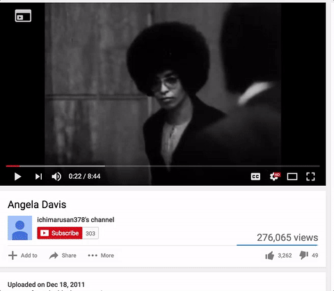
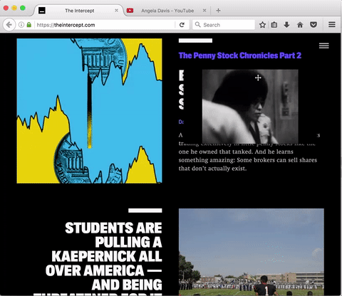

  

 

Min Vid is a Firefox add-on that gives you **complete control** over the videos in your browser.
You can pop out, sticky, resize, and drag videos anywhere within the browser - it even stays visible when you switch tabs, so you can keep watching while you browse.

This is an experiment - seeing what happens when users have
total control over the media they're consuming on the web. Users should be
able to consume content in whatever way they feel comfortable. In the
future we may be exploring these concepts with other forms of media,
such as audio or pdfs.

## Usage

Once the addon is installed you are able to launch Min Vid from the
overlay icon over videos on YouTube and Vimeo.

You can also launch Min Vid by right clicking on a video link and
sending to the player from the context menu.

## Installation

* `npm run package`
* set `xpinstall.signatures.required` in `about:config`
* install xpi by dragging onto the `about:addons` page

**note**
The `xpinstall.signatures.required` option in `about:config` needs to
be set in order to install unsigned addons.

## Development
Contributions welcome. To get started,

1.  Clone the repo:

   `https://github.com/meandavejustice/min-vid.git`
2.  Install packages:

   `npm install`

3. install [autoinstaller addon](https://addons.mozilla.org/en-US/firefox/addon/autoinstaller/)

4. `npm run dev` to watch for file changes while developing.

For further information on contributing, see [contributing.md](./contributing.md)

## Notes

[data/img/loading-bars.svg](data/img/loading-bars.svg) is from https://github.com/jxnblk/loading

## LICENSE
[Mozilla Public License 2.0](LICENSE)
