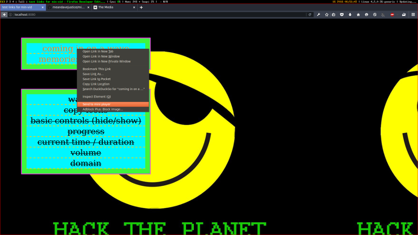
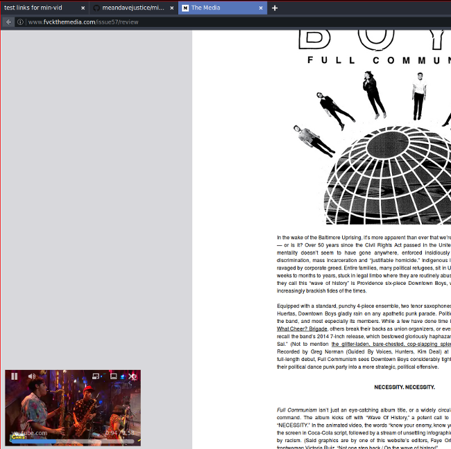
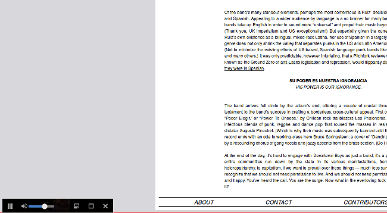

# Min-Vid

Min-Vid is a Firefox add-on which lets you minimize a web video and
keep it within the browser window. The video panel stays visible even
when you switch tabs, so you can keep watching while you browse.

The goal is to experiment with what it means to start to give the user
control over the media they are consuming on the web. Users should be
able to consume content in whatever mean they feel comfortable. In the
future we may be exploring these concepts with other forms of media,
such as audio or pdfs.

## Installation

We are still in the development phase with this experiment, you will
need to navigate to `about:config` and set the `xpinstall.signatures.required`
option to `true`, in order to install the addon. From there, you may download
the addon from [dist/addon.xpi](dist/addon.xpi) in this repo. And
install it by dragging it onto the `about:addons` page.

* set `xpinstall.signatures.required` in `about:config`
* download xpi from [our temporary location](https://people.mozilla.org/~jhirsch/min-vid-addon/addon.xpi)
* install xpi by dragging onto the `about:addons` page

## Usage

Once you have the addon installed, you will be able to right click on
video links(youtube supported, others coming soon) and select the
`send to mini player` option from the context menu.

 

 

You can switch tabs and continue browsing as usual

 

 

You may also minimize the video while still controlling playback

## Development
This is a proof of concept, there are bugs. contributions welcome. To get started,

1.  Clone the repo:

   `https://github.com/meandavejustice/min-vid.git`
2.  Install packages:

   `npm install`

3. install [autoinstaller addon](https://addons.mozilla.org/en-US/firefox/addon/autoinstaller/)

4. `npm run watch` to watch for file changes while developing.

5. Before submitting a Pull Request, package the Add-on:

   `npm run package`

## LICENSE
[Mozilla Public License 2.0](LICENSE)
