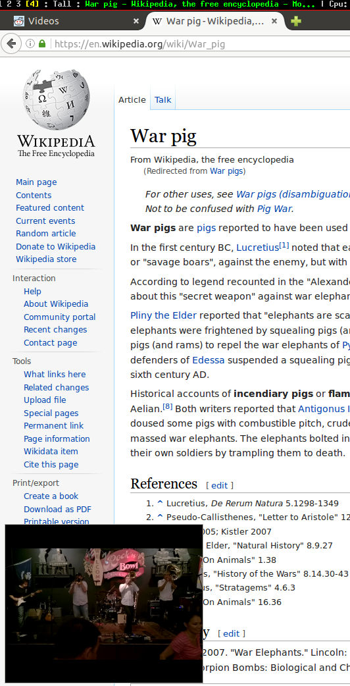

# Min-Vid
Min-Vid is a Firefox add-on which lets you minimize a web video and keep it within the browser window. The video panel stays visible even when you switch tabs, so you can keep watching while you browse.

## Usage

Install the xpi located at [dist/addon.xpi](dist/addon.xpi) and right
click on a video link (only YouTube currently supported). In the context
menu you will see an option 'Send to mini player'.

You can switch tabs and continue browsing as usual

## Development
This is a proof of concept, there are bugs. contributions welcome. To get started, 

1.  Clone the repo:

   `https://github.com/meandavejustice/min-vid.git`
2.  Install packages:

   `npm install` 
3. Before submitting a Pull Request, package the Add-on:

   `npm run package`

## Helpful
Use the [Extension Auto-Installer](https://addons.mozilla.org/en-US/firefox/addon/autoinstaller/) to automatically update your add-on when you make changes.

After you install Extension Auto-Installer, run:

`npm run watch`

## LICENSE
Mozilla Public License 2.0
