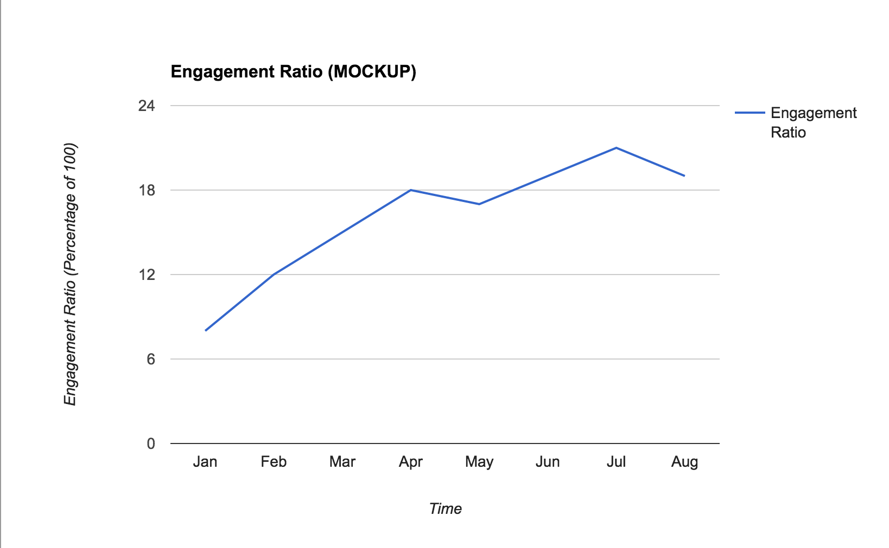
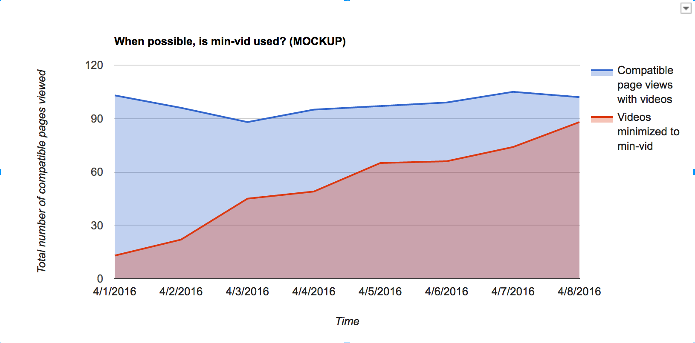

# METRICS

## Data Analysis
The collected data will primarily be used to answer the following questions.
Images are used for visualization and are not composed of actual data.

### Do people want to use this?

What is the overall usage of Min Vid?  **This is the standard DAU/MAU
analysis.**  This graph reports overall installations of Min Vid, but does not
report actual usage of the add-on's functionality.



On pages where compatible video elements exist and are playing, how often is Min Vid initialized?




### Additional interesting questions

- How long is a video kept minimized?
- What sites are used the most? (youtube, random video elements etc)
- What is the most common placement and size for the video frame?


## Data Collection

Min Vid has no server side component, so all data is gathered on the client and
reported via Firefox's Telemetry System. Min Vid will not do any batching on
the client side, instead sending pings immediately.

### Event types

Here is the complete set of object/method event pairs sent by Min Vid.
The events are tied to button clicks (like 'play' or 'pause') unless
otherwise noted.

* Object: `contextmenu`
  * method: `activate`
    * Sent when the user right-clicks a video link and sends it to the Min Vid player.

* Object: `error_view`
  * method: `render`
    * Sent when the error view is displayed (a video failed to load).

* Object: `loading_view`
  * method: `close`

* Object: `player_view`
  * method: `video_loaded`
    * Sent when the video has loaded in the player view.
  * method: `video_ended`
    * Sent when the video completed full playback.
  * method: `send_to_tab`
  * method: `play`
  * method: `replay`
  * method: `pause`
  * method: `mute`
  * method: `unmute`
  * method: `minimize`
  * method: `maximize`
  * method: `close`

* Object: `replay_view`
  * method: `close`
  * method: `play-from-history`
    * Sent play-from-history link is engaged from replay view. This pulls multiple items
      from the history array, adds them to the queue, and starts playback.

* Object: `confirm_view` (_Confirm launching of YouTube playlist or individual video_)
  * method: `cancel`
  * method: `launch:playlist:${action}`
    * Sent when playlist launched from overlay or context menu.
    * 'action' is either going to be 'send-to-queue' or 'play'
  * method: `launch:video:${action}`
    * Sent when playlist launched from overlay or context menu.
    * 'video' segment of method refers to individual videos launched, which are part of a playlist.
    * 'action' is either going to be 'send-to-queue' or 'play'

* Object: `queue_view`
  * method: `clear:queue`
  * method: `clear:history`
  * method: `track-added-from-history`
    * add track to bottom of queue from the history tab
  * method: `track-expedited`
    * track pushed to top of queue from queue tab
  * method: `track-reordered`
    * drag n drop reordering event

* Object: `overlay_icon`
  * method: `available`
    * Sent when a video is available on a page.
* Object: `overlay_icon`
  * method: `launch`
    * Sent when a video is launched from the overlay icon.

Here's an example of a complete Test Pilot telemetry ping. Note that Min Vid only sends the
`payload` portion to the Test Pilot add-on. The Test Pilot add-on appends the `test` and `agent`
fields, transforms the `timestamp` from a standard JavaScript milliseconds-since-epoch time
to the number of seconds since Firefox app startup, and wraps the payload under the `payload` key.

```js
// Example: complete Test Pilot telemetry ping:
{
  "test": "@min-vid",                // The em:id field from the add-on
  "agent": "User Agent String",
  "payload": {
    "object": "player_view",         // UI component
    "method": "pause",               // Event type

    "domain": "youtube.com",         // Domain from a whitelist of video hosting sites

    "video_x": 1150,                 // Distance in pixels from left side of browser
                                     // window to left side of Min Vid panel
    "video_y": 1200,                 // Distance in pixels from top of browser window
                                     // to top of Min Vid panel
    "video_width": 300,              // Width of Min Vid player, in pixels
    "video_height": 110,             // Height of Min Vid panel, in pixels
    "timestamp": 1470                // Timestamp in seconds since Firefox started (note:
                                     // Min Vid sends over a regular JS millisecond timestamp,
                                     // the Test Pilot add-on converts it to seconds since startup)
  }
}
```

A Redshift schema for the payload:

```js
local schema = {
--   column name                   field type   length  attributes   field name
    {"timestamp",                  "TIMESTAMP", nil,    "SORTKEY",   "Timestamp"},
    {"uuid",                       "VARCHAR",   36,      nil,         get_uuid},

    {"test",                       "VARCHAR",   255,     nil,         "Fields[test]"},

    -- Parsed automatically from the `agent` field
    {"user_agent_browser",         "VARCHAR",   255,     nil,         "Fields[user_agent_browser]"},
    {"user_agent_os",              "VARCHAR",   255,     nil,         "Fields[user_agent_os]"},
    {"user_agent_version",         "VARCHAR",   255,     nil,         "Fields[user_agent_version]"},

    {"object",                     "VARCHAR",   255,     nil,         "payload[object]"},
    {"method",                     "VARCHAR",   255,     nil,         "payload[method]"},
    {"domain",                     "VARCHAR",   255,     nil,         "payload[domain]"},

    {"video_x",                    "INTEGER",   4,       nil,         "payload[video_x]"},
    {"video_y",                    "INTEGER",   4,       nil,         "payload[video_y]"},
    {"video_width",                "INTEGER",   4,       nil,         "payload[video_width]"},
    {"video_height",               "INTEGER",   4,       nil,         "payload[video_height]"}
}
```

Note that we are *not* recording which videos are watched, only the domain it was watched on.

All data is kept by default for 180 days.

### Changing the Event Format

When changing keys in the metrics data object, be sure to
- update the add-on version
- ping the data team to update the Redshift schema (clone [this](https://bugzilla.mozilla.org/show_bug.cgi?id=1270586) Bugzilla bug)
